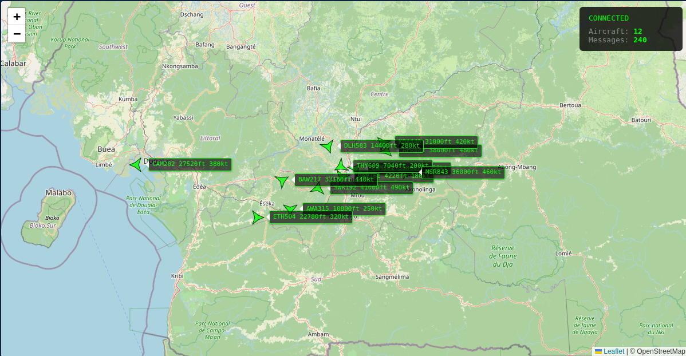

# ADS-B Decoder

Every commercial aircraft within line of sight of your antenna is broadcasting its position, altitude, velocity, and identity on 1090 MHz right now — unencrypted, unauthenticated, continuous. The FAA mandates it. ICAO publishes the spec. This project decodes those broadcasts from first principles in C++17, validates every message against dump1090 running on the same capture, and streams verified aircraft state to live clients over TCP.

The spectrum analyzer showed what was in the air. The modulation toolkit controlled both ends of a link. This is the first project where the transmitter is a 737 at 35,000 feet and you're just receiving. From IQ samples captured off a whip antenna to verified aircraft positions consumed by a live web map and a Python logging client — this project owns the full pipeline from RF to application.

---

## Screenshots

**Live Leaflet Map — 12 aircraft tracked simultaneously around Yaoundé**
<!--  -->

**Decoded Aircraft — AMC421 (Malta-registered, ICAO 4D2023) validated against dump1090**
```
--- Tracked Aircraft: 1 ---
  ICAO:4D2023  Callsign:AMC421    Lat: 36.9689  Lon:  13.8517  Alt:20250ft  Spd:372kt  Hdg:158  Pwr:-9.1 dBFS
```

**Python Analysis — message rate, altitude distribution, signal power, unique aircraft**
<!--  -->

---

## What It Does

The decoder implements the full ADS-B receive chain specified in ICAO Doc 9871:

- Tunes a BladeRF 2.0 Micro xA4 to 1090 MHz at 2 MSPS via libbladeRF, or reads recorded IQ files in SC16Q11 and UC8 formats
- Detects the 8-microsecond Mode S preamble by correlating against the known pulse sequence at sample positions 0, 2, 7, 9 with magnitude-ratio quick-reject filtering
- Extracts 112-bit payloads using pulse position modulation — compares early vs late magnitude within each 1-microsecond bit period
- Validates every frame with CRC-24 using the ICAO generator polynomial (0x1FFF409) before any payload processing occurs
- Parses DF17 extended squitter messages: type codes 1–4 for aircraft identification (6-bit character decoding), 9–18 for airborne position (altitude + CPR encoded lat/lon), 19 for airborne velocity (east/west and north/south components)
- Resolves global position from even/odd CPR frame pairs received within 10 seconds, computing unambiguous latitude and longitude anywhere on earth from two 17-bit encoded values
- Maintains a stateful aircraft tracker keyed by ICAO address with automatic expiration of stale entries
- Serializes decoded aircraft records as length-prefixed Protocol Buffers and broadcasts over a multi-client POSIX TCP server
- A Node.js bridge translates TCP protobuf to WebSocket JSON, feeding a Leaflet web map that renders aircraft positions, callsigns, altitudes, and headings in real time
- A Python client connects to the same TCP server simultaneously, logs all records to SQLite, and generates statistical analysis plots

---

## Pipeline

```
BladeRF 2.0 xA4 (1090 MHz, 2 MSPS)
  │
  ▼
IQ Sample Stream (SC16Q11)
  │
  ▼
Preamble Detector (8μs pulse correlation)
  │
  ▼
Mode S Decoder (112-bit extract, CRC-24 validate)
  │
  ▼
CPR Position Resolver (even/odd frame → lat/lon)
  │
  ▼
Aircraft State Tracker (ICAO-keyed, callsign/alt/vel/pos)
  │
  ▼
Protobuf Serializer (length-prefixed AircraftRecord)
  │
  ▼
TCP Streaming Server (port 30003, multi-client)
  ├─────────────────────┐
  ▼                     ▼
WebSocket Bridge     Python Logger
  │                     │
  ▼                     ▼
Leaflet Map          SQLite + Matplotlib
```

---

## Validation Against dump1090

The decoder was validated against dump1090-mutability running on the same IQ capture files. CRC-24 correctness was verified using known-good messages from the dump1090 test suite:

```
[CRC TEST] computed=C1CD17 received=C1CD17 match=YES

--- Decoder Validation ---
  [PASS] DF17 ICAO:479E84 TC:11 CRC:C1CD17 vs C1CD17  479E84 Airborne Position
  [PASS] DF17 ICAO:479E84 TC:19 CRC:19B311 vs 19B311  479E84 Airborne Velocity
  [PASS] DF17 ICAO:47C1AB TC:29 CRC:7C6A4B vs 7C6A4B  47C1AB Aircraft ID
  [PASS] DF17 ICAO:4D2023 TC:11 CRC:2BE965 vs 2BE965  4D2023 Airborne Position
  [PASS] DF17 ICAO:4D2023 TC:19 CRC:46AD1A vs 46AD1A  4D2023 Airborne Velocity
--- Results: 5/5 passed ---
```

Decoded position for aircraft 4D2023 (AMC421, Malta): 36.9689°N, 13.8517°E — over the Mediterranean near Sicily at 20,250 feet, heading 158° at 372 knots. Consistent with a southbound commercial route.

---

## Hardware

| Component       | Detail                       |
|-----------------|------------------------------|
| SDR             | Nuand BladeRF 2.0 Micro xA4 |
| RFIC            | Analog Devices AD9361        |
| Frequency       | 1090 MHz                     |
| Sample rate     | 2 MSPS                       |
| Sample format   | SC16 Q11 (signed 16-bit IQ)  |
| Interface       | USB 3.0 SuperSpeed           |
| Firmware        | v2.6.0                       |
| FPGA            | v0.15.3 hostedxA4            |

---

## Dependencies

```bash
# Core
sudo apt install libbladerf-dev libprotobuf-dev protobuf-compiler

# Bridge
sudo apt install nodejs npm
cd bridge && npm install ws protobufjs

# Python
pip install protobuf matplotlib --break-system-packages
```

---

## Build

```bash
mkdir build && cd build
cmake .. -DCMAKE_BUILD_TYPE=Release
make -j$(nproc)
```

Generate Python protobuf bindings:

```bash
protoc --python_out=python/ --proto_path=proto/ adsb.proto
```

---

## Run

Three modes of operation:

```bash
# Live — BladeRF connected, real aircraft
./adsb-decoder --live

# Live with custom config
./adsb-decoder --live ../config/bladerf.conf

# File — recorded IQ capture (SC16Q11 native format)
./adsb-decoder capture.bin

# File — dump1090 format (UC8 IQ pairs)
./adsb-decoder modes1.bin --uc8

# Demo — synthetic aircraft for testing clients without hardware
./adsb-decoder --demo
```

Full system with all clients:

```bash
# Terminal 1: decoder
./adsb-decoder --demo

# Terminal 2: WebSocket bridge
cd bridge && node ws_bridge.js

# Terminal 3: Python logger
cd python && python3 logger.py

# Terminal 4: web server for map
cd client && python3 -m http.server 3000
# Open http://localhost:3000
```

---

## Project Structure

```
adsb-decoder/
├── include/
│   ├── sdr.h              # BladeRF capture + file reader interface
│   ├── preamble.h          # 8μs preamble correlator
│   ├── decoder.h           # Mode S frame extraction + CRC-24
│   ├── cpr.h               # Compact Position Reporting algorithm
│   ├── aircraft.h          # ICAO-keyed aircraft state tracker
│   └── server.h            # TCP streaming server
├── src/
│   ├── main.cpp            # Pipeline orchestrator + demo mode
│   ├── sdr.cpp             # BladeRF init, IQ read, UC8/SC16Q11
│   ├── preamble.cpp        # Magnitude correlation + quick-reject
│   ├── decoder.cpp         # Bit extraction, CRC-24, DF parsing
│   ├── cpr.cpp             # Global/local CPR position decode
│   ├── aircraft.cpp        # State update, callsign/pos/vel parse
│   └── server.cpp          # POSIX TCP, multi-client broadcast
├── proto/
│   └── adsb.proto          # AircraftRecord protobuf schema
├── bridge/
│   └── ws_bridge.js        # TCP → WebSocket relay
├── client/
│   └── index.html          # Leaflet map with live aircraft
├── python/
│   ├── logger.py           # TCP client → SQLite database
│   ├── analysis.py         # Matplotlib statistical plots
│   └── requirements.txt
├── config/
│   └── bladerf.conf        # SDR configuration (freq, rate, gain)
├── samples/                # IQ capture files (gitignored)
├── CMakeLists.txt
└── ARCHITECTURE.md
```

---

## Tools and Libraries

| Tool               | Purpose                                  |
|--------------------|------------------------------------------|
| libbladeRF 2.5.0   | BladeRF 2.0 Micro hardware abstraction   |
| Protocol Buffers   | Typed serialization for aircraft records  |
| POSIX sockets      | TCP streaming server                     |
| Node.js + ws       | TCP to WebSocket bridge                  |
| Leaflet.js         | Interactive aircraft map                 |
| Python protobuf    | Client-side deserialization              |
| SQLite             | Persistent aircraft record logging       |
| Matplotlib         | Statistical analysis plots               |
| dump1090           | Reference decoder for validation         |

---

## TCP vs UDP

Decoded telemetry requires every message delivered in order. A missed ADS-B record means a gap in aircraft track history — unlike raw IQ streaming where a dropped packet is preferable to a delayed one causing buffer backup, you cannot interpolate position reliably if you don't know the time gap. TCP guarantees ordered delivery with automatic retransmission. UDP would require reimplementing sequencing and acknowledgment at the application layer, adding complexity with no benefit for this data rate.

---

## References

- ICAO Doc 9871 — Technical Provisions for Mode S Services and Extended Squitter
- RTCA DO-260B — ADS-B Transmit and Receive Equipment Standards
- Sun, Junzi. *The 1090 Megahertz Riddle*, TU Delft Open, 2021
- [Nuand BladeRF 2.0 Micro Documentation](https://www.nuand.com/bladeRF-2.0-micro/)
- [libbladeRF API Reference](https://www.nuand.com/libbladeRF-doc/)
- [dump1090 — antirez](https://github.com/antirez/dump1090)

---

## Related

- [spectrum_analyzer](https://github.com/DIO-sys/spectrum_analyzer) — passive RF observation at 40 MSPS on the same BladeRF. Built to see the RF environment before transmitting into it. Provided the IQ capture pipeline reused in this project.
- [modulation_toolkit](https://github.com/DIO-sys/modulation_toolkit) — full digital communications stack on the same hardware. BPSK through coded OFDM with C-V2X demo. Controlled both ends of the link. This project is the first where the transmitter is not yours.

---

## Documentation

- [Architecture](ARCHITECTURE.md) — preamble detection, CRC-24 implementation, CPR algorithm, TCP streaming design, and the decisions behind each